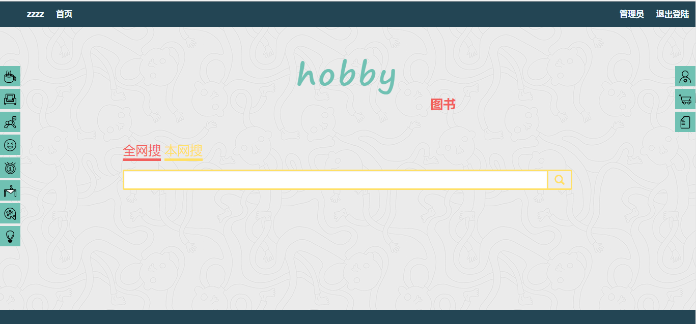
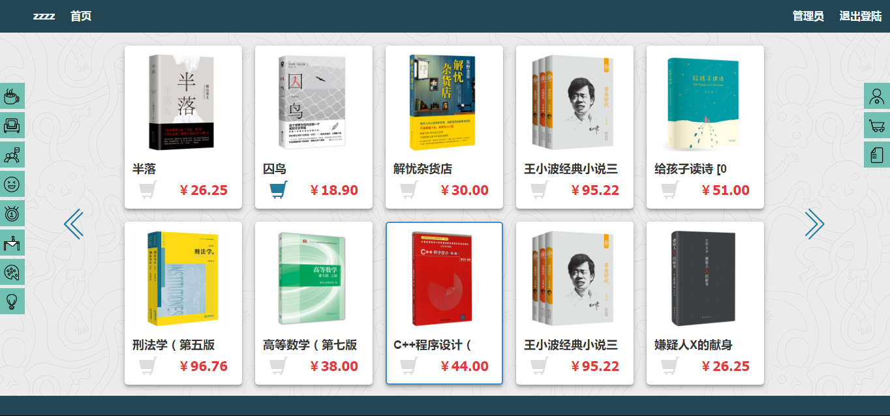
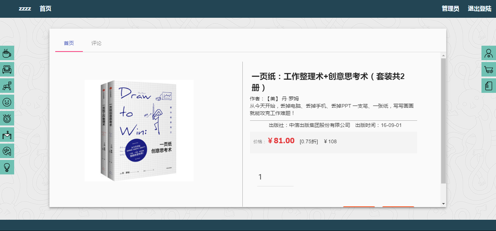
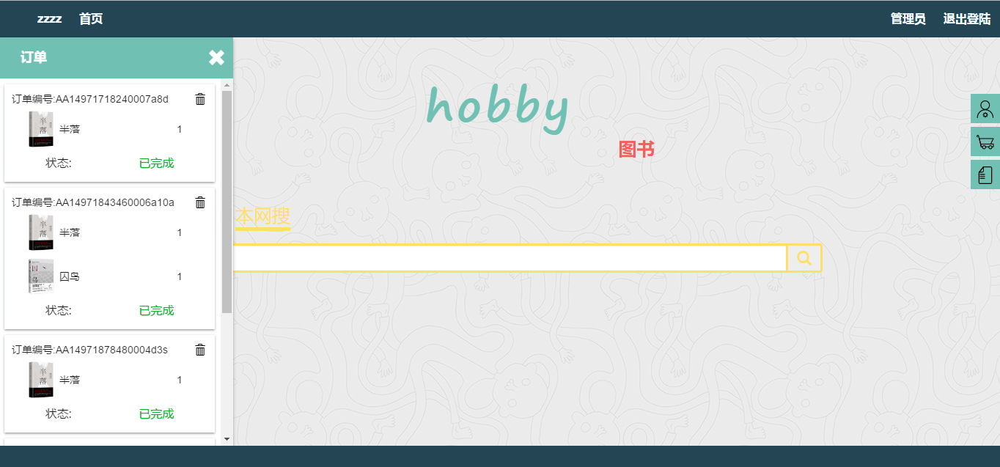
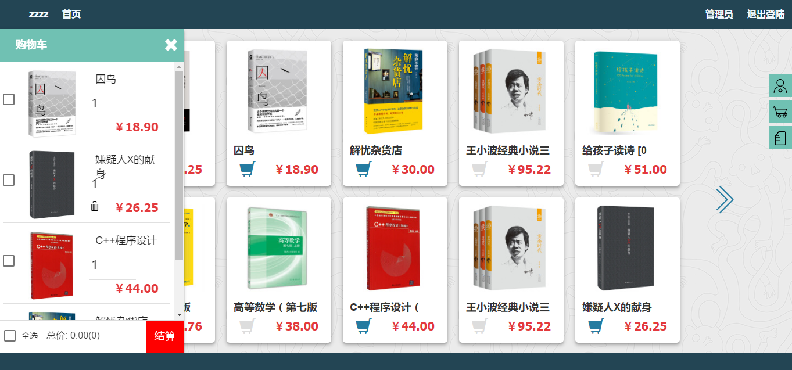
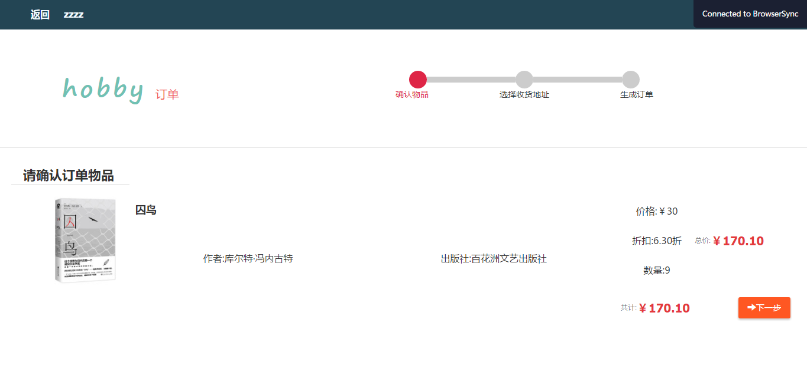

# hobby-project
一个网上书店系统 前端
### 实现功能：
*  图书展示
*  登录与注册
*  购物车
*  订单
*  商品评论
*  后台：管理员界面

### 技术栈：
*  angularjs
*  gulp
### 使用方法：
##### 解压npm-modules包在主目录下运行
    gulp myweb
### 截图

#### 搜索页面
  

#### 书本列表
  

#### 书本详细信息
  

#### 订单状态
  

#### 购物车
  

#### 订单界面
  

#### 管理员界面
  

